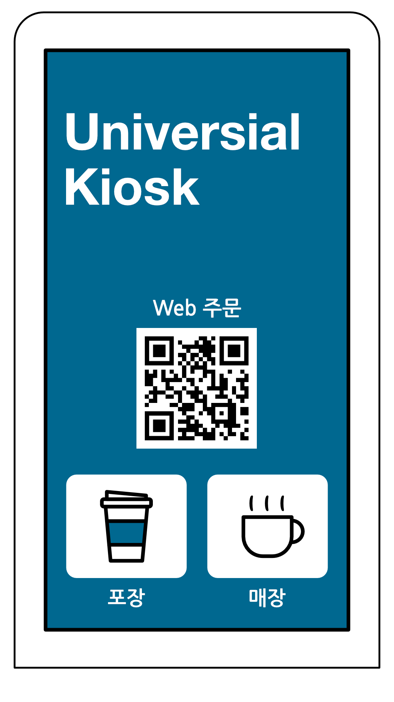

# 작동 방식

## Web 주문

## 키오스크
- 키오스크 기기 또한 웹 기반으로 제작 예정

## 스마트폰
1. QR코드 인식
2. Web 주문 페이지로 이동
3. Web 주문 페이지에서 메뉴 주문
4. 키오스크 or Web 주문 페이지에서 결제

### QR코드 인식
1. 일반적인 QR코드 인식앱으로 가능 (기본 카메라앱, 카카오톡 등등)
2. 인식시 Web 주문 페이지로 이동

### 주문
- 키오스크 주문과 동일하게 웹에서 주문이 가능하게 함

### 결제
- 모바일에서 카드, 삼성페이, 등으로 결제가 가능하게 함 + 키오스크 기기에서 결제가 가능하게 함

## 장애인용 기기
1. QR코드 인식
2. 키오스크가 장애인용 기기를 인식
3. 메뉴 항목들을 읽어줌
4. 키패드로 주문
5. 키오스크에서 결제

### QR코드 인식
1. ESP32-CAM을 사용해서 QR코드 인식
2. ESP-NOW or HTTP 통신
3. 키오스크가 장애인 기기 인식

### 주문
1. 키오스크에서 음성으로 메뉴 안내
2. 키패드 숫자 조합으로 메뉴 선택
3. ESP-NOW or HTTP 통신으로 숫자 조합 전송 
4. 키오스크 기기가 숫자 조합 받음
5. pyautogui 같은 라이브러리로 키오스크 조작
6. 결제는 키오스크에서 진행하는 것과 동일하게 진행